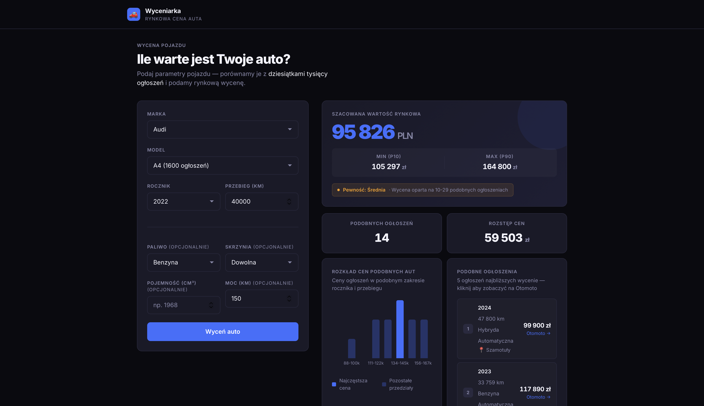

# 🚗 Car Valuator — Wyceniarka samochodów

Aplikacja webowa przewidująca rynkową cenę używanego samochodu na podstawie ponad **59 000 ogłoszeń** zescrapowanych z Otomoto. Pełny pipeline: scraping → uczenie maszynowe → API → frontend.

**🔗 [Live demo](https://car-valuator-henna.vercel.app)** · **🔗 [Backend API docs](https://car-valuator.onrender.com/docs)**



> ⚠️ Backend jest hostowany na darmowym planie Render — pierwsze zapytanie po dłuższej bezczynności może potrwać do 50 sekund (cold start).

---

## Co robi aplikacja

Użytkownik podaje markę, model, rocznik i przebieg samochodu (opcjonalnie też paliwo, skrzynię, pojemność i moc silnika). Aplikacja zwraca:

- przewidywaną cenę rynkową wyliczoną przez model XGBoost
- przedział cenowy (percentyle p10–p90) na podstawie podobnych ogłoszeń
- poziom pewności wyceny (na podstawie liczby porównywalnych ofert)
- histogram rozkładu cen podobnych aut
- listę 5 najbardziej zbliżonych ogłoszeń z linkami do Otomoto

## Stack technologiczny

**Frontend** — Next.js 16 (App Router), React 19, TypeScript, Tailwind CSS, Recharts. Server Components do pobierania danych katalogowych, Client Components dla interaktywnego formularza.

**Backend** — FastAPI, Python 3.12, SQLAlchemy 2.0 (async) + asyncpg, Alembic, Pydantic. Model ML ładowany raz przy starcie serwera do pamięci.

**Machine Learning** — scikit-learn Pipeline (imputacja braków, kodowanie kategorii) + XGBoost. Trening na logarytmie ceny dla lepszej stabilizacji wariancji.

**Scraping** — curl_cffi do omijania podstawowych zabezpieczeń antybotowych, ekstrakcja danych bezpośrednio z `__NEXT_DATA__` (JSON wbudowany w stronę Otomoto), bez parsowania HTML.

**Infrastruktura** — PostgreSQL, Docker, deployment: Vercel (frontend) + Render (backend i baza danych).

## Wyniki modelu

| Metryka | Wartość |
|---|---|
| Liczba rekordów treningowych | 58 110 |
| Liczba modeli samochodów | 44 |
| MAPE (błąd procentowy) | 16.97% |
| MAE (błąd średni) | 7 939 PLN |
| Mediana błędu bezwzględnego | 4 297 PLN |

Model trenowany jest na cechach dostępnych ze strony wyników wyszukiwania Otomoto (rok, przebieg, pojemność, moc, paliwo, skrzynia, marka, model). Cechy wymagające wejścia na stronę szczegółów ogłoszenia (bezwypadkowość, pierwszy właściciel, faktura VAT) nie są obecnie uwzględniane — ich dodanie to naturalny kierunek dalszego rozwoju i obniżenia MAPE.

## Architektura

```
car-valuator/
├── frontend/          Next.js → Vercel
│   ├── app/            strony (App Router)
│   ├── components/      formularz, wykres, tabela wyników
│   └── lib/             typy TS + klient API
│
└── backend/            FastAPI + scraper + ML → Render
    ├── app/             API (jedyna część działająca 24/7)
    │   ├── api/          endpointy: /predict, /brands
    │   ├── services/      logika predykcji i wyszukiwania podobnych ofert
    │   └── core/          konfiguracja, ładowanie modelu
    ├── db/              modele SQLAlchemy + migracje Alembic
    ├── scraper/          pipeline scrapowania Otomoto
    └── ml/               trening i ewaluacja modelu
```

## Uruchomienie lokalne

### Backend

```bash
cd backend
uv sync
docker-compose up -d        # PostgreSQL
cp ../.env.example ../.env  # i uzupełnij wartości
alembic upgrade head
uvicorn app.main:app --reload --port 8000
```

### Frontend

```bash
cd frontend
npm install
echo "NEXT_PUBLIC_API_URL=http://localhost:8000" > .env.local
npm run dev
```

### Scraper i trening modelu (opcjonalnie)

```bash
cd backend
python -m scraper.run     # pełny crawl ~2-3h
python -m ml.evaluate      # trening + ewaluacja + zapis artefaktów
```

## Najciekawsze wyzwania techniczne

**Otomoto miesza modele na stronach wyników.** Strona `/audi/a4` zwraca też ogłoszenia A3, A6 i Q5. Rozwiązaniem była weryfikacja rzeczywistego modelu z parametrów ogłoszenia (`normalizer.py`) zamiast ufania samemu URL-owi wyszukiwania, a dla niektórych marek — scrapowanie osobnych wariantów nadwozia (np. `a4-limousine` i `a4-avant`) pod wspólny rekord modelu w bazie.

**Dane ukryte w `__NEXT_DATA__`.** Zamiast parsować HTML, dane wyciągane są bezpośrednio z JSON-a w `urqlState` (cache GraphQL Next.js), co jest szybsze i odporniejsze na zmiany layoutu strony.

**Train/serve skew.** Cały preprocessing (imputacja, kodowanie) jest częścią jednego serializowanego `sklearn.Pipeline`, więc trening i inference w API wykonują dokładnie te same transformacje.

---

Projekt portfolio. Kod źródłowy: [github.com/Karrolxd/car-valuator](https://github.com/Karrolxd/car-valuator)